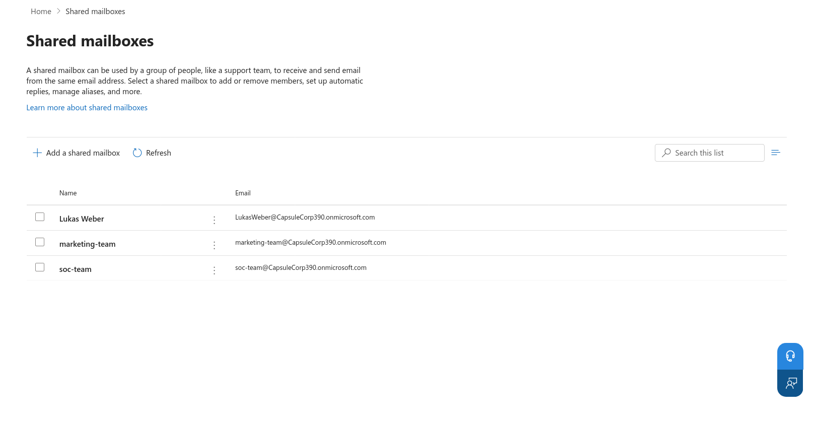
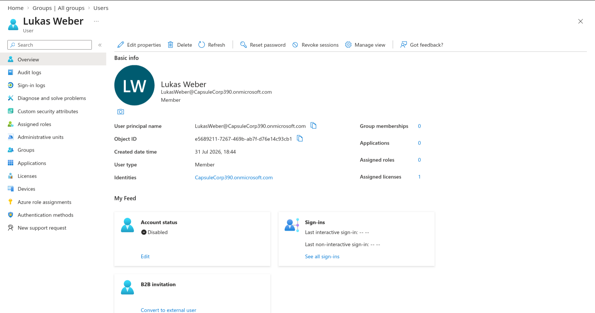
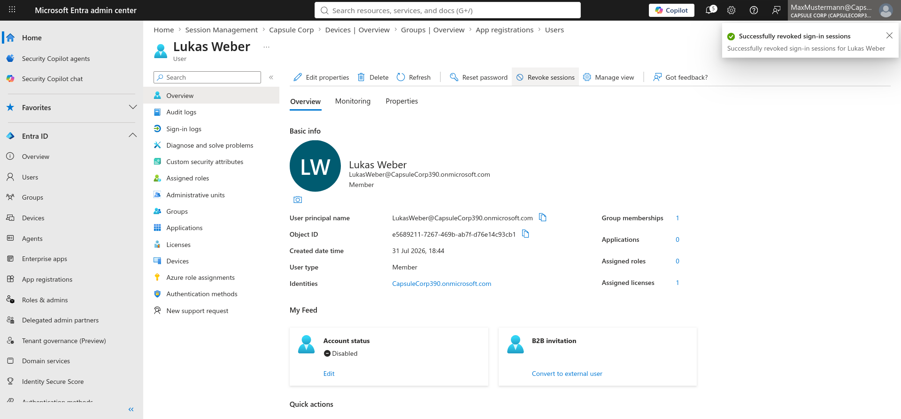
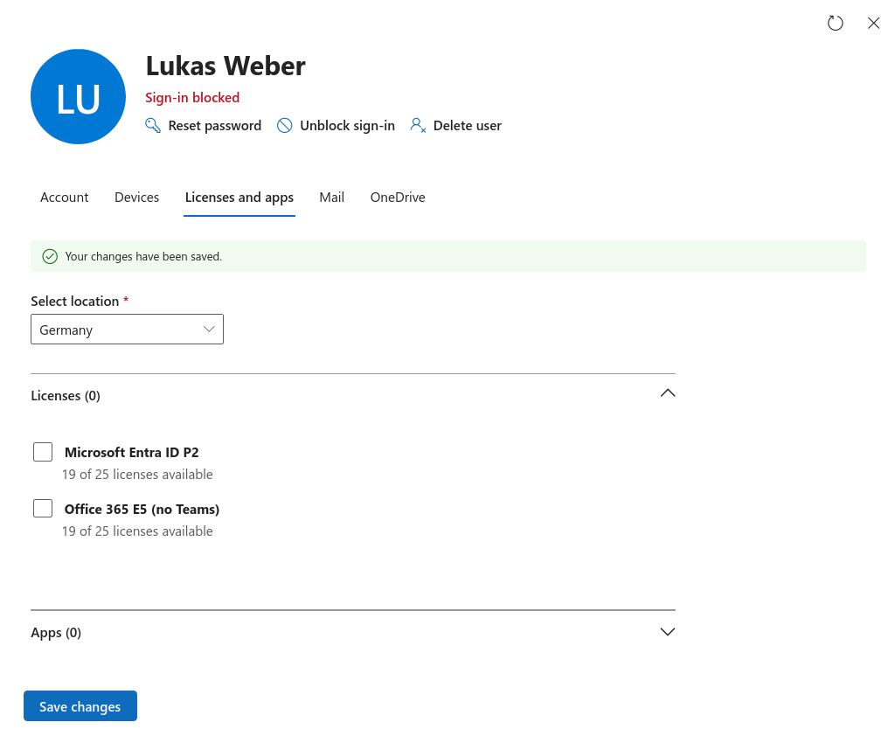
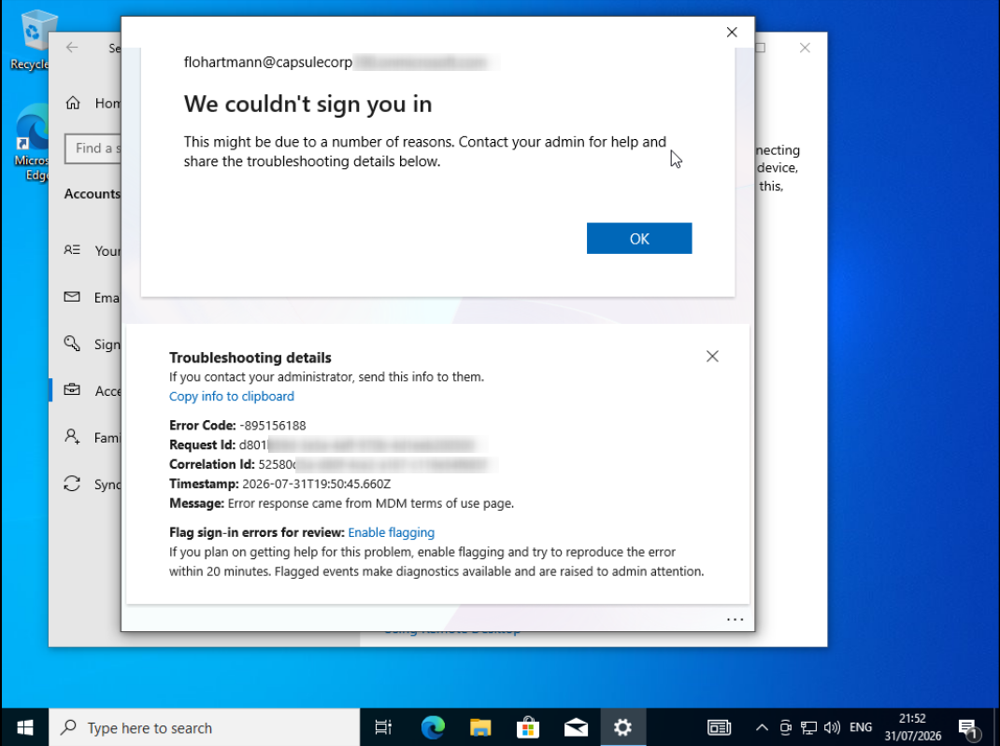
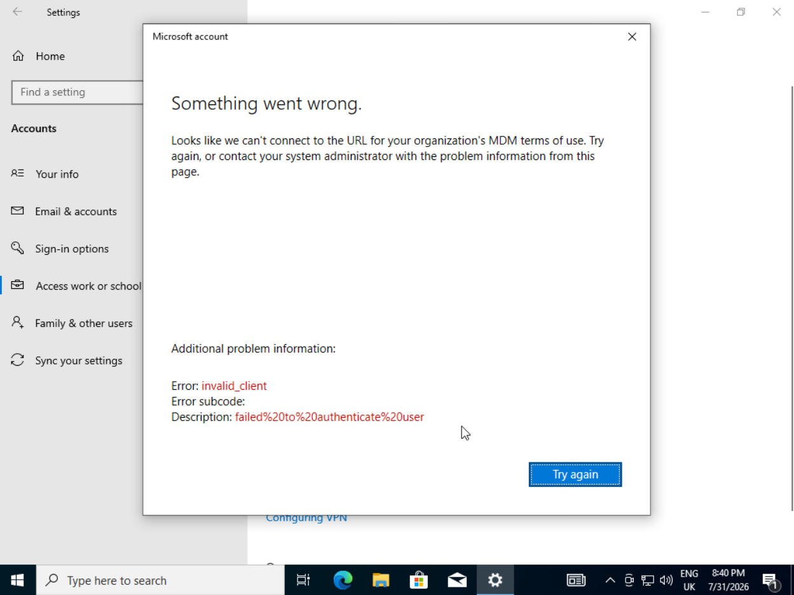
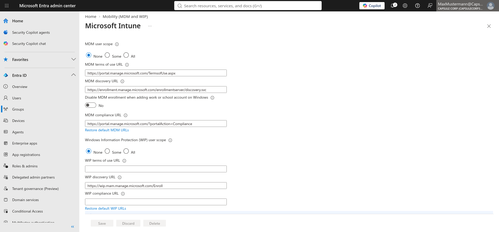
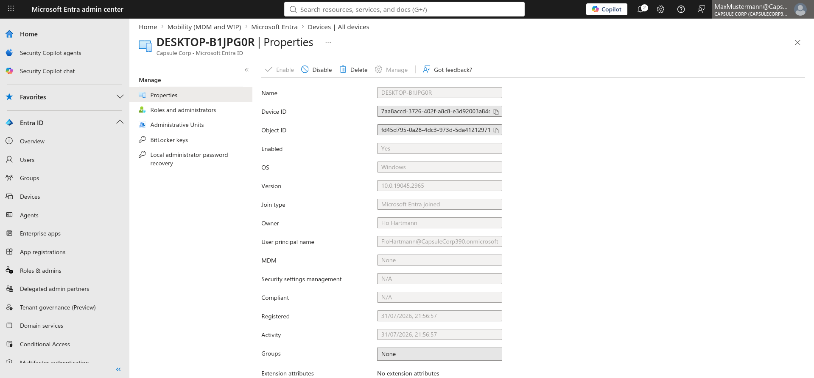

# 🚀 Microsoft 365 Administration Lab


## 📌 Executive Summary

This project demonstrates common Microsoft 365 administration tasks in a test environment. The lab includes Microsoft Entra ID user management, security groups, Exchange Online shared mailboxes, user offboarding, and Microsoft Intune troubleshooting.

---

## Project Highlights

- ✅ Created Microsoft Entra ID users and groups
- ✅ Assigned Microsoft 365 licenses
- ✅ Managed Exchange Online shared mailboxes
- ✅ Simulated employee onboarding and offboarding
- ✅ Joined Windows devices to Microsoft Entra ID
- ✅ Investigated Microsoft Intune enrollment issues
- ✅ Produced detailed technical documentation

---

# 📖 Table of Contents

- [Skills Demonstrated](#skills-demonstrated)
- [Tasks Performed](#tasks-performed)
- [Environment Overview](#environment-overview)
- [Lab Architecture](#lab-architecture)
- [Tenant Configuration](#tenant-configuration)
- [Security Groups](#security-groups)
- [User Administration](#user-administration)
- [Shared Mailbox](#shared-mailbox)
- [User Offboarding](#user-offboarding)
- [Microsoft Intune Troubleshooting](#microsoft-intune-troubleshooting)
- [Root Cause Analysis](#root-cause-analysis)
- [Troubleshooting Performed](#troubleshooting-performed)
- [Current Status](#current-status)
- [Future Improvements](#future-improvements)
- [Technologies Used](#technologies-used)
- [Project Outcome](#project-outcome)


---

# Skills Demonstrated

- Microsoft 365 Administration
- Microsoft Entra ID
- Exchange Online
- Shared Mailboxes
- User & Identity Management
- Security Groups
- License Management
- User Offboarding
- Microsoft Intune
- Device Enrollment
- Windows Administration
- Technical Troubleshooting
- Technical Documentation

---

# Tasks Performed

During this lab, I completed the following Microsoft 365 administration tasks:

- Created and managed Microsoft Entra ID users
- Created security groups and Microsoft 365 groups
- Assigned Microsoft 365 licenses
- Managed user roles and permissions
- Created and managed Exchange Online shared mailboxes
- Simulated a complete employee offboarding process
- Revoked user sessions and disabled accounts
- Removed licenses and group memberships
- Joined a Windows device to Microsoft Entra ID
- Investigated Microsoft Intune device enrollment issues
- Documented troubleshooting steps and findings

  ---

# Environment Overview

## Tenant Configuration

| Property | Value |
|----------|-------|
| Tenant | Capsule Corp |
| Domain | CapsuleCorp390.onmicrosoft.com |
| Identity Platform | Microsoft Entra ID |
| Productivity Platform | Microsoft 365 |
| Endpoint Management | Microsoft Intune |
| Administrator | Max Mustermann |

---

## Lab Architecture

```text
                  Microsoft 365 Tenant
                          │
        ┌─────────────────┼─────────────────┐
        │                 │                 │
        ▼                 ▼                 ▼
 Microsoft Entra ID   Exchange Online   Microsoft Intune
        │
        ▼
 Windows 10 Enterprise VM

```
---

## 📸 Screenshots

> Place screenshots inside an `images/` directory.

```
images/
├── tenant-overview.png
├── entra-dashboard.png
├── users.png
├── security-groups.png
├── shared-mailbox.png
├── disable-user.png
├── revoke-session.png
├── mailbox-converted.png
├── remove-license.png
├── mdm-error.png
├── invalid-client.png
├── mdm-scope.png
├── entra-connected.png
└── myaccount.png
```

---

# Security Groups

Created the following security groups for RBAC and policy targeting.

| Group | Type | Purpose |
|------|------|---------|
| CapsuleCorp-Marketing-Dept | Security | Department-based assignments |
| CapsuleCorp-Devices-Windows | Security | Windows device targeting |
| All Company | Microsoft 365 | Organization-wide collaboration |

📸


---

# User Administration

Created multiple Microsoft Entra ID users.

## Markus Fischer

- Enterprise Cloud User
- Office 365 E5 (No Teams)
- Microsoft Entra ID P2

## Jack

- Enterprise Cloud User
- Office 365 E5 (No Teams)
- Microsoft Entra ID P2

## Lukas Weber

- Standard Enterprise User
- Used for offboarding simulation
- Disabled
- Unlicensed

📸


---

# Shared Mailbox

Created a departmental shared mailbox.

**Address**

```
marketing-team@CapsuleCorp390.onmicrosoft.com
```

Purpose

- Shared communications
- Team collaboration
- Mailbox delegation

📸


---

# User Offboarding

Simulated a secure employee offboarding process.

Workflow:

```text
Employee Leaves
      │
      ▼
Disable Account
      │
      ▼
Revoke Sessions
      │
      ▼
Convert Mailbox
      │
      ▼
Delegate Mailbox
      │
      ▼
Remove Licenses
      │
      ▼
Remove Group Membership
```

## Tasks Performed

### Disable User

Disabled sign-in through Microsoft Entra ID.

📸


---

### Revoke Sessions

Revoked all active refresh tokens.

Affected services:

- Outlook
- Teams
- OneDrive
- Microsoft 365

Equivalent Microsoft Graph command:

```powershell
Revoke-MgUserSignInSession
```

📸


---

### Convert Mailbox

Converted the user mailbox into a Shared Mailbox.

📸


---

### Delegate Mailbox Access

Assigned administrative access to the converted mailbox.

---

### Remove Licenses

Recovered Microsoft 365 licenses for future assignment.

📸


---

### Remove Security Group Memberships

Removed the user from departmental security groups.

---

# Microsoft Intune Troubleshooting
## Objective

Join a Windows 10 Enterprise virtual machine to Microsoft Entra ID and automatically enroll it into Microsoft Intune.

---

## Initial Error

During device enrollment, Windows displayed:

```
We couldn't sign you in

This might be due to a number of reasons.

Error Code:
-895156188

Message:
Error response came from MDM terms of use page.
```

### Diagnostic Information

```
Error Code:
-895156188

Request Id:
d801b59d-3e5a-4aff-970b-4d1eeb200500

Correlation Id:
52580d5a-d80f-4ce2-a167-c119e54f685f

Timestamp:
2026-07-31T19:50:45.660Z

Message:
Error response came from MDM terms of use page.
```

📸


---

## Subsequent Error

After additional enrollment attempts:

```
Something went wrong.

Looks like we can't connect to the URL for your organization's MDM terms of use.

Error:
invalid_client

Description:
failed to authenticate user
```

📸



---

# Root Cause Analysis

During enrollment, Windows successfully contacted Microsoft Entra ID.

However, automatic MDM enrollment redirected authentication to Microsoft Intune.

The enrollment failed before completing authentication.

Observed workflow:

```text
Windows Device
      │
      ▼
Microsoft Entra Join
      │
      ▼
Automatic MDM Enrollment
      │
      ▼
Microsoft Intune Authentication
      │
      ▼
Authentication Failure
      │
      ▼
Enrollment Aborted
```

---

# Troubleshooting Performed

The following troubleshooting steps were completed:

- Verified Microsoft Entra automatic enrollment configuration.
- Verified Mobility (MDM and MAM) settings.
- Checked MDM User Scope.
- Verified assigned Microsoft 365 licenses.
- Verified Microsoft Entra ID P2 licensing.
- Reviewed Microsoft Intune enrollment settings.
- Removed existing workplace registrations.
- Removed Microsoft Entra device registration.
- Re-ran device enrollment.
- Used:

```cmd
dsregcmd /status
```

to verify device registration status.

- Used:

```cmd
dsregcmd /leave
```

to remove existing registration.

- Removed cached organizational accounts.
- Rebooted and retried enrollment multiple times.
- Attempted enrollment using different user accounts.
- Reviewed enrollment errors.
- Investigated Microsoft Intune licensing requirements.
- Verified automatic enrollment behavior.

Despite these efforts, the device was **not successfully enrolled into Microsoft Intune**.

---

# Temporary Workaround

To continue testing Microsoft Entra ID functionality, automatic MDM enrollment was disabled.

Configuration changed:

```
Microsoft Entra ID

↓

Mobility (MDM and MAM)

↓

Microsoft Intune

↓

MDM User Scope

↓

ALL

↓

NONE
```

After disabling automatic MDM enrollment:

✅ Microsoft Entra ID Join completed successfully.

The Windows device showed:

```
Connected to Capsule Corp's Azure AD
```

However,

❌ Microsoft Intune enrollment was skipped because MDM enrollment was disabled.

📸


📸



---

# Current Status

| Component | Status |
|------------|--------|
| Microsoft Entra Join | ✅ Successful |
| Device Registration | ✅ Successful |
| Microsoft Intune Enrollment | ❌ Failed |
| MDM Auto Enrollment | Disabled |
| Shared Mailbox | ✅ Completed |
| User Offboarding | ✅ Completed |

---

# Known Issue

Although Microsoft Entra ID Join was successful, Microsoft Intune enrollment could not be completed.

The exact cause remains undetermined.

Possible contributing factors include:

- Intune licensing configuration
- Automatic enrollment policy
- MDM Terms of Use authentication
- Tenant configuration
- Microsoft Intune service configuration

Further investigation is required.

---

# Future Improvements

- Successfully enroll Windows devices into Microsoft Intune.
- Identify the root cause of the `invalid_client` authentication error.
- Validate Microsoft Intune licensing with a Microsoft 365 license that includes Intune.
- Test enrollment using Microsoft 365 E5 or Microsoft Intune Plan 1.
- Review Conditional Access and Enrollment Restrictions.
- Validate MDM Terms of Use endpoint behavior.
- Continue investigating Microsoft Intune enrollment failures in a production-like environment.

---

# Technologies Used

- Microsoft 365 Admin Center
- Microsoft Entra ID
- Microsoft Intune
- Exchange Online
- Windows 10 Enterprise
- Microsoft Graph
- QEMU/KVM
- OAuth 2.0
- OpenID Connect

---


# Project Outcome

This project demonstrates practical Microsoft 365 administration in a test environment.

The completed tasks include:

- Microsoft Entra ID user administration
- Security group management
- Exchange Online shared mailbox administration
- Microsoft 365 license management
- User offboarding procedures
- Microsoft Intune enrollment troubleshooting

Although Microsoft Intune enrollment could not be completed, the issue was systematically investigated and documented. Microsoft Entra ID Join was completed successfully, demonstrating a structured troubleshooting approach similar to real-world IT administration.
