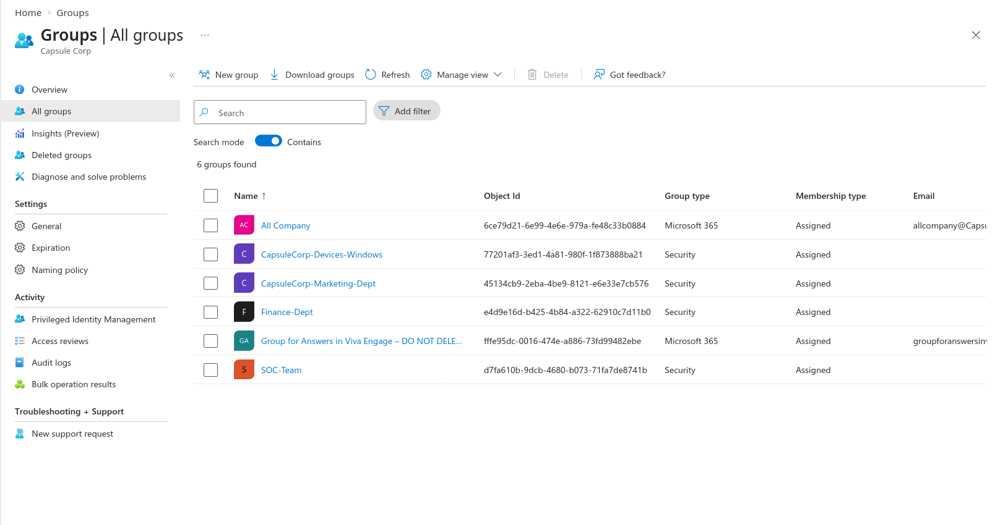
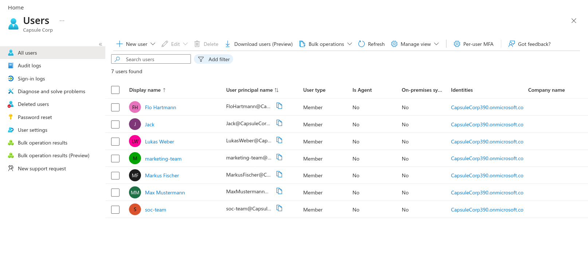

# 🚀 Microsoft 365 & Entra ID Identity Lifecycle, Governance & MDM Diagnostic Lab

## 📌 Executive Summary

This repository documents a hands-on Microsoft 365 administration lab built within the **Capsule Corp** Microsoft 365 tenant (`CapsuleCorp390.onmicrosoft.com`).

The project covers identity lifecycle management, Microsoft Entra ID administration, RBAC implementation, Exchange Online mailbox management, user offboarding, and Microsoft Intune device enrollment troubleshooting.

Although Microsoft Entra ID Join was successfully completed, Microsoft Intune enrollment remained unresolved despite extensive troubleshooting. The issue has been documented as an identified limitation and future improvement area.

---

# 📖 Table of Contents

- [Environment Overview](#environment-overview)
- [Tenant Configuration](#tenant-configuration)
- [Security Groups](#security-groups)
- [User Management](#user-management)
- [Shared Mailbox Management](#shared-mailbox-management)
- [User Offboarding](#user-offboarding)
- [Microsoft Intune Troubleshooting](#microsoft-intune-troubleshooting)
- [Root Cause Analysis](#root-cause-analysis)
- [Troubleshooting Performed](#troubleshooting-performed)
- [Current Status](#current-status)
- [Future Improvements](#future-improvements)
- [Technologies Used](#technologies-used)
- [Skills Demonstrated](#skills-demonstrated)

---

# 🏗️ Environment Overview

## Tenant Information

| Property | Value |
|----------|-------|
| Tenant | Capsule Corp |
| Domain | CapsuleCorp390.onmicrosoft.com |
| Identity Platform | Microsoft Entra ID |
| Productivity Platform | Microsoft 365 |
| Endpoint Management | Microsoft Intune |
| Administrator | Max Mustermann |

---

## 📸 Screenshots

> Place screenshots inside an `images/` directory.

```
images/
├── tenant-overview.png
├── entra-dashboard.png
├── users.png
├── security-groups.png
├── shared-mailbox.png
├── disable-user.png
├── revoke-session.png
├── mailbox-converted.png
├── remove-license.png
├── mdm-error.png
├── invalid-client.png
├── mdm-scope.png
├── entra-connected.png
└── myaccount.png
```

---

# 👥 Security Groups

Created the following security groups for RBAC and policy targeting.

| Group | Type | Purpose |
|------|------|---------|
| CapsuleCorp-Marketing-Dept | Security | Department-based assignments |
| CapsuleCorp-Devices-Windows | Security | Windows device targeting |
| All Company | Microsoft 365 | Organization-wide collaboration |

📸


---

# 👤 User Administration

Created multiple Microsoft Entra ID users.

## Markus Fischer

- Enterprise Cloud User
- Office 365 E5 (No Teams)
- Microsoft Entra ID P2

## Jack

- Enterprise Cloud User
- Office 365 E5 (No Teams)
- Microsoft Entra ID P2

## Lukas Weber

- Standard Enterprise User
- Used for offboarding simulation
- Disabled
- Unlicensed

📸


---

# 📧 Shared Mailbox

Created a departmental shared mailbox.

**Address**

```
marketing-team@CapsuleCorp390.onmicrosoft.com
```

Purpose

- Shared communications
- Team collaboration
- Mailbox delegation

📸

`images/shared-mailbox.png`

---

# 🔒 Module 1 — User Offboarding

Simulated a secure employee offboarding process.

Workflow:

```text
Employee Leaves
      │
      ▼
Disable Account
      │
      ▼
Revoke Sessions
      │
      ▼
Convert Mailbox
      │
      ▼
Delegate Mailbox
      │
      ▼
Remove Licenses
      │
      ▼
Remove Group Membership
```

## Tasks Performed

### Disable User

Disabled sign-in through Microsoft Entra ID.

📸

`images/disable-user.png`

---

### Revoke Sessions

Revoked all active refresh tokens.

Affected services:

- Outlook
- Teams
- OneDrive
- Microsoft 365

Equivalent Microsoft Graph command:

```powershell
Revoke-MgUserSignInSession
```

📸

`images/revoke-session.png`

---

### Convert Mailbox

Converted the user mailbox into a Shared Mailbox.

📸

`images/mailbox-converted.png`

---

### Delegate Mailbox Access

Assigned administrative access to the converted mailbox.

---

### Remove Licenses

Recovered Microsoft 365 licenses for future assignment.

📸

`images/remove-license.png`

---

### Remove Security Group Memberships

Removed the user from departmental security groups.

---

# 🛠 Module 2 — Microsoft Intune Enrollment Troubleshooting

## Objective

Join a Windows 10 Enterprise virtual machine to Microsoft Entra ID and automatically enroll it into Microsoft Intune.

---

## Initial Error

During device enrollment, Windows displayed:

```
We couldn't sign you in

This might be due to a number of reasons.

Error Code:
-895156188

Message:
Error response came from MDM terms of use page.
```

### Diagnostic Information

```
Error Code:
-895156188

Request Id:
d801b59d-3e5a-4aff-970b-4d1eeb200500

Correlation Id:
52580d5a-d80f-4ce2-a167-c119e54f685f

Timestamp:
2026-07-31T19:50:45.660Z

Message:
Error response came from MDM terms of use page.
```

📸

`images/mdm-error.png`

---

## Subsequent Error

After additional enrollment attempts:

```
Something went wrong.

Looks like we can't connect to the URL for your organization's MDM terms of use.

Error:
invalid_client

Description:
failed to authenticate user
```

📸

`images/invalid-client.png`

---

# Root Cause Analysis

During enrollment, Windows successfully contacted Microsoft Entra ID.

However, automatic MDM enrollment redirected authentication to Microsoft Intune.

The enrollment failed before completing authentication.

Observed workflow:

```text
Windows Device
      │
      ▼
Microsoft Entra Join
      │
      ▼
Automatic MDM Enrollment
      │
      ▼
Microsoft Intune Authentication
      │
      ▼
Authentication Failure
      │
      ▼
Enrollment Aborted
```

---

# Troubleshooting Performed

The following troubleshooting steps were completed:

- Verified Microsoft Entra automatic enrollment configuration.
- Verified Mobility (MDM and MAM) settings.
- Checked MDM User Scope.
- Verified assigned Microsoft 365 licenses.
- Verified Microsoft Entra ID P2 licensing.
- Reviewed Microsoft Intune enrollment settings.
- Removed existing workplace registrations.
- Removed Microsoft Entra device registration.
- Re-ran device enrollment.
- Used:

```cmd
dsregcmd /status
```

to verify device registration status.

- Used:

```cmd
dsregcmd /leave
```

to remove existing registration.

- Removed cached organizational accounts.
- Rebooted and retried enrollment multiple times.
- Attempted enrollment using different user accounts.
- Reviewed enrollment errors.
- Investigated Microsoft Intune licensing requirements.
- Verified automatic enrollment behavior.

Despite these efforts, the device was **not successfully enrolled into Microsoft Intune**.

---

# Temporary Workaround

To continue testing Microsoft Entra ID functionality, automatic MDM enrollment was disabled.

Configuration changed:

```
Microsoft Entra ID

↓

Mobility (MDM and MAM)

↓

Microsoft Intune

↓

MDM User Scope

↓

ALL

↓

NONE
```

After disabling automatic MDM enrollment:

✅ Microsoft Entra ID Join completed successfully.

The Windows device showed:

```
Connected to Capsule Corp's Azure AD
```

However,

❌ Microsoft Intune enrollment was skipped because MDM enrollment was disabled.

📸

`images/mdm-scope.png`

📸

`images/entra-connected.png`

---

# Current Status

| Component | Status |
|------------|--------|
| Microsoft Entra Join | ✅ Successful |
| Device Registration | ✅ Successful |
| Microsoft Intune Enrollment | ❌ Failed |
| MDM Auto Enrollment | Disabled |
| Shared Mailbox | ✅ Completed |
| User Offboarding | ✅ Completed |

---

# Known Issue

Although Microsoft Entra ID Join was successful, Microsoft Intune enrollment could not be completed.

The exact cause remains undetermined.

Possible contributing factors include:

- Intune licensing configuration
- Automatic enrollment policy
- MDM Terms of Use authentication
- Tenant configuration
- Microsoft Intune service configuration

Further investigation is required.

---

# Future Improvements / Fix Needed

- Successfully enroll Windows devices into Microsoft Intune.
- Identify the root cause of the `invalid_client` authentication error.
- Validate Microsoft Intune licensing with a Microsoft 365 license that includes Intune.
- Test enrollment using Microsoft 365 E5 or Microsoft Intune Plan 1.
- Review Conditional Access and Enrollment Restrictions.
- Validate MDM Terms of Use endpoint behavior.
- Continue investigating Microsoft Intune enrollment failures in a production-like environment.

---

# Technologies Used

- Microsoft Entra ID
- Microsoft 365 Admin Center
- Microsoft Intune
- Exchange Online
- Windows 10 Enterprise
- QEMU/KVM
- OAuth 2.0
- OpenID Connect
- Microsoft Graph
- Device Registration Service (DRS)

---

# Skills Demonstrated

- Microsoft Entra ID Administration
- Microsoft 365 Administration
- Exchange Online
- Shared Mailbox Management
- User Lifecycle Management
- User Offboarding
- Security Groups
- RBAC
- Session Revocation
- License Management
- Microsoft Intune Administration
- Device Enrollment Troubleshooting
- Windows Enterprise Administration
- Root Cause Analysis
- Technical Documentation

---

# Project Outcome

This lab successfully demonstrated enterprise Microsoft 365 administration workflows including identity management, Exchange Online administration, RBAC implementation, and secure employee offboarding.

An attempt was made to integrate Microsoft Intune with Microsoft Entra ID for automatic MDM enrollment. Despite extensive troubleshooting, the device could not be enrolled into Intune. As a temporary workaround, automatic MDM enrollment was disabled, allowing the device to successfully join Microsoft Entra ID.

The unresolved Microsoft Intune enrollment issue has been documented as a known limitation and future improvement area, reflecting a realistic troubleshooting scenario encountered in enterprise IT environments.
